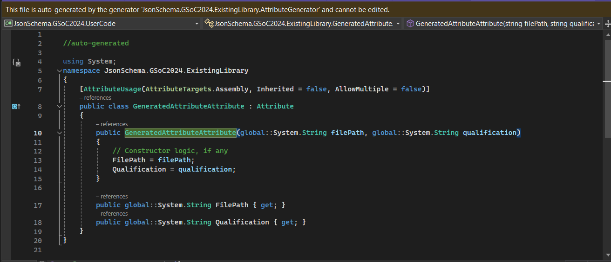
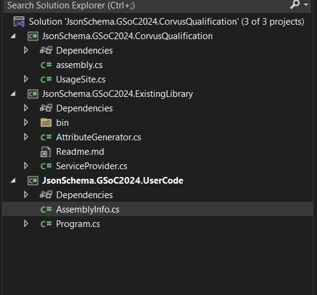
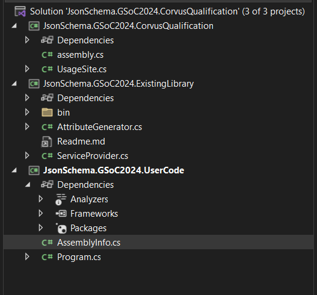

# ExistingLibrary NuGet Package - Usage Instructions

This readme provides instructions on how to use the ExistingLibrary NuGet package, which includes a `GeneratedAttribute` and the `ServiceProvider` functionality.

## Usage in Your Project:

- Now that the ExistingLibrary NuGet package is installed in your project, follow these steps to use the included features:

### Declaring the `GeneratedAttribute`

1. In your project, import the namespace where the generated attribute is used:

```csharp
using JsonSchema.GSoC2024.ExistingLibrary;
```

2. Now, declare the generated attribute with two string parameters, where the first parameter is the path to a JSON schema file, and the second parameter is the namespace (JsonSchema.GSoC2024.CorvusQualification).below the namespace

```csharp
[assembly: GeneratedAttribute("path/to/schema.json", "JsonSchema.GSoC2024.CorvusQualification")]
```

As the attribute is assembly level it is recommended to used it in assemblyInfo.cs in case .net framework and create a sperated file called assemblyinfo.cs and used it incase of others

3.  (Optional) Rebuild the project to create the source code.

    

4.  (Optional) you can see the autogenerated c# code by `ctrl+click`the attributes :

    

After Sucessfull declaration you will notice a analyer under dependencies



### Utilizing the ServiceProvider

- In your project, create an instance of the ServiceProvider class and use it as needed:

```csharp
using JsonSchema.GSoC2024.ExistingLibrary;

namespace YourNamespace
{
    public class YourClass
    {
        ServiceProvider serviceProvider = new ServiceProvider();

    }
}
```
