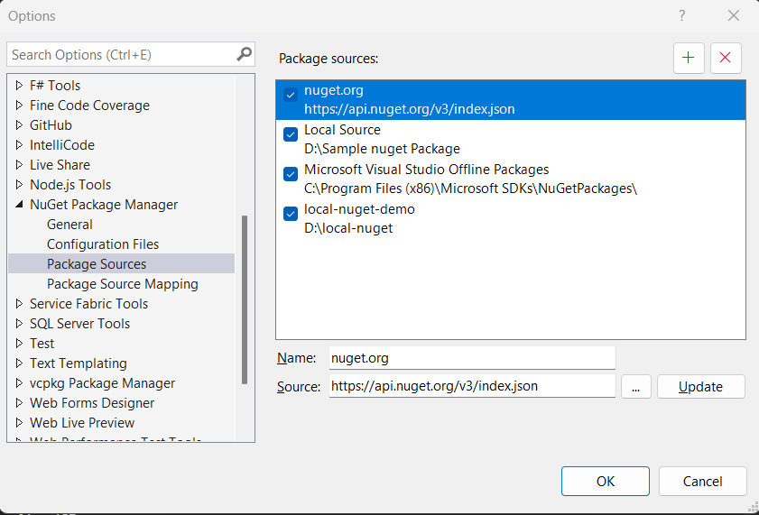
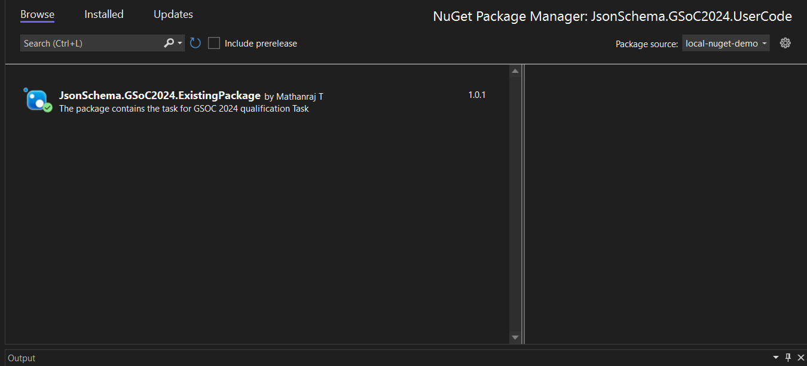

# Json Schema GSOC 2024 Qualification Task Solution

Welcome to the JSON Schema GSOC 2024 Qualification Task solution repository! This project addresses compilation issues in the CorvusQualification project by updating the ExistingPackage. The main goals include enhancing the ExistingPackage to generate a missing attribute, enabling smooth referencing in the CorvusQualification project, and creating a NuGet package for broader usability.

## Task Accomplishments

- ExistingPackage is now capable of generating the missing attribute.
- The CorvusQualification project successfully references the ExistingPackage as a project reference.
- A NuGet package for ExistingPackage has been generated and is being referenced by the UserCode project.

## Existing library usage in another project

### Project Reference

Add Project Reference:

1. dotnet restore: to get all dependencies

1. Open the project file of the target project (e.g., CorvusQualification).

1. Include a project reference to ExistingPackage with the following entry:

```xml
<ProjectReference Include="..\JsonSchema.GSoC2024.ExistingPackage\JsonSchema.GSoC2024.ExistingPackage.csproj"
                  OutputItemType="Analyzer" />

```

4.  build and run the project (optional) use ctrl+click on generated to navigate to the generated code

### Package Reference

To use this package, follow the steps in the [Readme](JsonSchema.GSoC2024.CorvusQualification/JsonSchema.GSoC2024.ExistingPackage/Readme.md):

#### Setting up a Local NuGet Package CLI

1. Package the NuGet package by navigating to the existing library folder:

   ```bash
   dotnet pack -c debug
   ```

2. Add a local source if not already present:

   ```bash
   dotnet nuget add source D:\local-nuget -n Local
   ```

3. Confirm the added source:

   ```bash
   dotnet nuget list source
   ```

4. Push the NuGet package to the local source (replace `<path-to-nuget-file>` with the actual path):

   ```bash
   dotnet nuget push "<path-to-nuget-file>" -s D:\local-nuget
   ```

   Example:

   ```bash
   dotnet nuget push "D:\Json Schema GSOC\JsonSchema.GSoC2024.CorvusQualification\JsonSchema.GSoC2024.ExistingPackage\bin\Debug\JsonSchema.GSoC2024.ExistingPackage.1.0.0.nupkg" -s "D:\local-nuget"
   ```

5. Use the package in another project (e.g., UserCode):

   ```bash
   dotnet add package JsonSchema.GSoC2024.ExistingPackage --version 1.0.0 --source local-nuget-demo
   ```

   Ensure you replace placeholders like `<path-to-nuget-file>` with the actual paths and version numbers as needed for your specific project.

> Note: The above steps can also be performed using the GUI in Visual Studio.

### Setting Up a Local NuGet Package Source GUI

1. **Create a Local Folder**:

   - Create a folder on your local system where you want to store your NuGet packages.

1. **Add a New Source**:

   - Click on the "+" icon in your NuGet package manager.

   

   - Enter the desired name for your new source.
   - Set the source path to the absolute path of the folder created in step 1.

1. **Move .nuget Files**:

   - Locate the `.nuget` files generated during the build process, typically found in the debug folder of your project.
   - Move these `.nuget` files into the folder created in step 1.

1. **Manage NuGet Packages**:
   - Open the NuGet package manager in your project.
   - Change the NuGet package source to the newly created local source.
   - 

By following these steps, you will have successfully set up a local NuGet package source for your project. You can build the project and move `.nuget` into the folder and use it in `UserCode` Project

### Learning and References

- Refer to the [learning.md](Learning.md) document attached, where I've documented my learning and references used to complete this task, including the creation of the source code generator.

> [Task link ](https://github.com/json-schema-org/community/issues/614)
